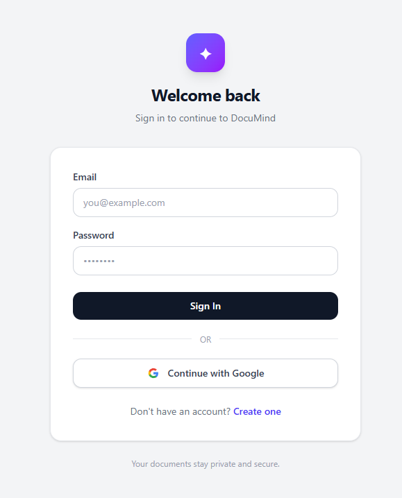
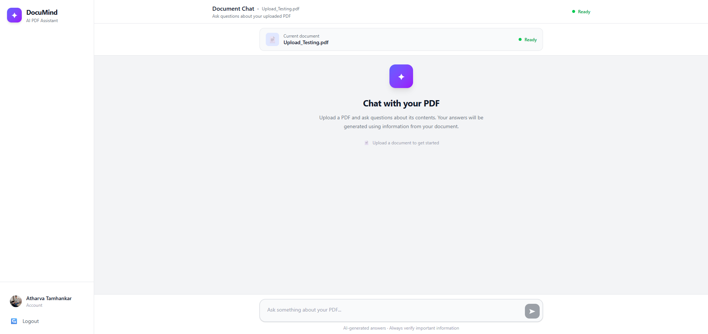

# DocuMind — RAG PDF Chatbot

DocuMind is a full-stack **Retrieval-Augmented Generation (RAG) PDF chatbot** that allows users to upload PDF documents and ask questions about their contents.

The application extracts and processes the document, generates semantic embeddings, retrieves the most relevant sections using vector similarity search, and uses **Google Gemini** to generate answers grounded in the uploaded document.

---

## 🚀 Features

- 📄 Upload and process PDF documents
- ✂️ Intelligent text chunking using LangChain
- 🧠 Semantic embeddings using Sentence Transformers
- 🔎 Similarity-based document retrieval using ChromaDB
- 🤖 AI-generated answers using Google Gemini
- 📚 Source references for generated answers
- 🔐 JWT-based authentication
- 🔑 Email/password authentication
- 🌐 Google OAuth authentication
- 👤 User profile information and Google profile picture
- 💬 Interactive chat interface
- ⌨️ Enter to send / Shift + Enter for multiline messages
- 📜 Automatic chat scrolling
- 📌 Scroll-to-latest-message button
- 📂 Collapsible retrieved sources
- ⚠️ API error and usage-limit handling
- 📱 Responsive React interface

---

## 🏗️ Architecture

```text
User
 │
 ▼
React + Tailwind CSS
 │
 │ HTTP Requests
 ▼
FastAPI Backend
 │
 ├── Authentication
 │     ├── JWT
 │     └── Google OAuth
 │
 ├── PDF Processing
 │     ├── PDF Text Extraction
 │     └── Text Chunking
 │
 ├── Embedding Generation
 │     └── Sentence Transformers
 │
 ├── Vector Search
 │     └── ChromaDB
 │
 └── Answer Generation
       └── Google Gemini
```

---

## 🔄 RAG Pipeline

```text
PDF Upload
    ↓
Text Extraction
    ↓
Text Chunking
    ↓
Embedding Generation
    ↓
Store Embeddings in ChromaDB
    ↓
User Question
    ↓
Question Embedding
    ↓
Similarity Search
    ↓
Retrieve Relevant Chunks
    ↓
Send Context + Question to Gemini
    ↓
Generate Grounded Answer
    ↓
Return Answer + Sources
```

---

## 🛠️ Tech Stack

### Frontend
- React
- Vite
- Tailwind CSS
- React Router
- React Markdown

### Backend
- Python
- FastAPI
- Uvicorn
- SQLAlchemy
- Pydantic

### AI / RAG
- Google Gemini
- Sentence Transformers (`all-MiniLM-L6-v2`)
- LangChain
- ChromaDB

### PDF Processing
- PyMuPDF
- Recursive Character Text Splitter

### Authentication
- JWT
- Google OAuth 2.0
- Authlib
- bcrypt password hashing

---

## 📁 Project Structure

The project is organized into separate frontend and backend applications.

```text
rag-pdf-chatbot/
│
├── backend/
│   ├── app/
│   │   ├── core/
│   │   ├── models/
│   │   ├── routes/
│   │   ├── services/
│   │   ├── utils/
│   │   └── main.py
│   │
│   ├── requirements.txt
│   └── .env
│
├── frontend/
│   ├── src/
│   │   ├── components/
│   │   ├── pages/
│   │   ├── App.jsx
│   │   ├── main.jsx
│   │   └── index.css
│   │
│   ├── package.json
│   └── vite.config.js
│
├── docs/
│
├── .gitignore
└── README.md
```

Generated files such as `venv`, `node_modules`, `chroma_db`, `uploads`, and Python cache files are excluded from version control.

---

## 📸 Screenshots

### Login



### Document Chat



---

## ⚙️ Installation

### 1. Clone the repository

```bash
git clone https://github.com/<your-username>/rag-pdf-chatbot.git
cd rag-pdf-chatbot
```

---

### 2. Backend Setup

Navigate to the backend:

```bash
cd backend
```

Create a virtual environment:

```bash
python -m venv venv
```

Activate it on Windows:

```bash
venv\Scripts\activate
```

Install dependencies:

```bash
pip install -r requirements.txt
```

---

### 3. Environment Variables

Create a `.env` file inside the `backend` directory.

```env
GEMINI_API_KEY=your_gemini_api_key

GOOGLE_CLIENT_ID=your_google_client_id
GOOGLE_CLIENT_SECRET=your_google_client_secret
GOOGLE_REDIRECT_URI=http://127.0.0.1:8000/auth/google/callback

TOP_K=5
```

Do **not** commit `.env` to GitHub.

---

### 4. Start the Backend

From the `backend` directory:

```bash
uvicorn app.main:app --reload
```

The backend will run at:

```text
http://127.0.0.1:8000
```

FastAPI documentation is available at:

```text
http://127.0.0.1:8000/docs
```

---

### 5. Frontend Setup

Open another terminal and navigate to the frontend:

```bash
cd frontend
```

Install dependencies:

```bash
npm install
```

Start the development server:

```bash
npm run dev
```

The frontend will typically be available at:

```text
http://localhost:5173
```

---

## 🔐 Authentication Flow

DocuMind supports two authentication methods:

### Email / Password

```text
Register
   ↓
Password Hashing
   ↓
User Stored in Database
   ↓
JWT Access Token
   ↓
Authenticated Application
```

### Google OAuth

```text
Continue with Google
        ↓
Google Authentication
        ↓
OAuth Callback
        ↓
Create / Find User
        ↓
JWT Access Token
        ↓
Authenticated Application
```

Protected API endpoints require a valid JWT access token.

---

## 🧠 Embedding & Retrieval

DocuMind uses the `all-MiniLM-L6-v2` Sentence Transformer model to generate embeddings.

Each text chunk is converted into a **384-dimensional vector**.

When a user asks a question:

1. The question is converted into an embedding.
2. ChromaDB performs similarity search.
3. The most relevant document chunks are retrieved.
4. The retrieved context is provided to Gemini.
5. Gemini generates an answer based on the retrieved information.

The system currently retrieves the top **5 relevant chunks**.

---

## 🤖 LLM Answer Generation

Google Gemini is used to generate the final response.

The prompt is designed to keep the model grounded in the retrieved document context rather than relying solely on general knowledge.

The chatbot also returns the retrieved source references alongside the generated answer.

---

## 🗄️ Database

The application uses a relational database through **SQLAlchemy** for storing user information.

User records include information such as:

- User ID
- Email
- Username
- Display name
- Password hash
- Authentication provider
- Google ID
- Profile picture

ChromaDB is used separately for storing and retrieving document embeddings.

---

## 🛡️ Error Handling

The application handles common API failures including:

- Invalid PDF uploads
- Authentication failures
- Invalid credentials
- Missing documents
- AI service unavailability
- AI usage limits
- Invalid or expired authentication tokens

---

## 📌 Current Status

The core application is complete and functional.

Implemented:

- PDF upload
- PDF text extraction
- Text chunking
- Embedding generation
- ChromaDB vector storage
- Semantic retrieval
- Gemini integration
- RAG-based question answering
- JWT authentication
- Google OAuth
- React frontend
- Responsive chat interface
- Source display
- Error handling

---

## 🔮 Future Improvements

Possible future improvements include:

- Persistent chat history
- Multiple documents per conversation
- Document management
- Streaming AI responses
- Improved mobile navigation
- Production deployment
- Cloud-based vector storage
- Cloud database integration
- Conversation-based document isolation

---

## 👨‍💻 Author

**Atharva Tamhankar**

B.Tech Computer Engineering

---

## 📄 License

This project is intended for educational and portfolio purposes.